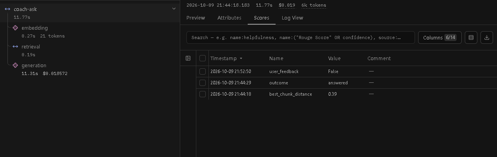

# fitnerd

**A full-stack fitness app with an AI coach grounded in real training content - not generic AI answers or influencer myths.**

Live: [fitnerd.betofallas.dev](https://fitnerd.betofallas.dev)

## What problem does it solve, and who is it for?

Most people who want to train on their own end up choosing between two bad options: expensive personal training, or free advice that's either a generic AI hallucinating exercise technique or a social media "influencer" repeating myths with no science behind them. fitnerd is for anyone who wants to train with correct technique and track real progress, without needing a coach on retainer - a catalog of exercises organized by body region, a place to log body metrics over time, and an AI coach that only answers from a curated library of real fitness video transcripts (and says "I don't know" instead of making something up when the answer isn't in there).

I built it as a personal project - both because I wanted exactly this tool for my own training, and as a way to prove out a full stack end-to-end: API design, a real SPA frontend, a RAG pipeline, and a real cloud deployment, not just another CRUD tutorial app.

## What it offers

- **Exercise catalog** (body region -> category -> exercise) with correct-technique videos
- **Favorites** and a **weekly workout plan**
- **Body metrics tracking** - weight, body-fat %, muscle-mass % with progress charts over time
- **AI Coach** - a RAG-grounded chat that only answers from real fitness content, with multi-turn conversation memory and a thumbs up/down rating on every answer
- Email/password auth **and** Google Sign-In
- **Password recovery by email** - a reset link (valid 5 minutes, single use) sent through Resend, with per-email and per-IP rate limits
- A feedback widget built right into the app
- Fully responsive, with an "add to home screen" shortcut for mobile

## Tech stack, and why

| Layer | Choice | Why |
|---|---|---|
| Backend | **Flask** | Lightweight and unopinionated - I wanted to make my own architectural decisions (layering, auth, error handling) instead of inheriting a framework's, while still having a mature ecosystem for exactly what I needed (SQLAlchemy, migrations, JWT, CORS). |
| Frontend | **React** (Vite + TypeScript) | The industry-standard choice for a real SPA, with the tooling and ecosystem to match - and the most directly transferable skill for a portfolio project. |
| Database | **PostgreSQL** | A mature, open-source relational database - and critically, its `pgvector` extension let me store both my relational data *and* the AI coach's vector embeddings in one database, instead of standing up a separate vector store for a corpus this size. |
| DB hosting | **Supabase** | Managed Postgres with native `pgvector` support and zero ops overhead (backups, connection pooling) - the right tradeoff for a project without a dedicated DBA. |
| Frontend hosting | **Vercel** | Zero-config static hosting for a Vite app, with automatic deploys on every push and a global CDN, for free. |
| Backend hosting | **AWS (EC2)** | I deliberately wanted hands-on experience running a real Linux server - Docker, a reverse proxy, HTTPS certificates, DNS - rather than only ever using fully managed platforms. |
| LLM observability | **Langfuse Cloud** | A RAG pipeline fails quietly: a bad answer looks the same as a good one unless you can see which chunks were retrieved, how close they were, what the call cost and how long each step took. Langfuse gives me that per question, plus real user ratings, so tuning the coach is based on data instead of guesses. I used its official OpenTelemetry-based SDK behind my own `Tracer` port, so the app never depends on it being up. |

## Architecture & design patterns

**Backend - layered architecture**, `routes -> services -> repositories -> models`, on top of Flask's **Application Factory pattern** (`create_app()`) rather than a module-level `Flask(__name__)`. Routes only handle HTTP concerns; services own business rules and validation; repositories are the *only* layer that talks SQLAlchemy - a service never touches the DB session directly, that's centralized behind a **Unit of Work**. I also used a **Repository pattern** with a shared base class for common queries, and ownership checks are done inside the query itself (e.g. "get this record *for this user*") rather than fetched-then-checked - so a valid ID belonging to someone else returns "not found" instead of leaking that the record exists. I chose this layering because it keeps each concern testable and swappable in isolation, and because it makes the codebase's rules explicit instead of implicit.

**Frontend - feature-based folders**, not type-based: each domain (`auth`, `exercises`, `body-metrics`, `coach`...) owns its own `types`, `api`, `hooks`, and `components`, mirroring the backend's per-domain split. API communication is three layers deep, each with one job: a single shared client handles the actual `fetch` + auth header + error normalization; each feature's `api.ts` knows which endpoint to call; each feature's `hooks.ts` wraps that in TanStack Query for caching and state. No component ever calls `fetch` directly. Same underlying philosophy as the backend: one direction of dependency, one job per layer.

## The AI Coach: how the RAG pipeline works

1. **Corpus acquisition**: real fitness videos are downloaded audio-only (`yt-dlp`) and transcribed locally with `faster-whisper` - chosen over a paid cloud transcription API since the corpus (100+ videos) made per-minute cloud pricing add up fast, while local compute is a one-time cost.
2. **Storage**: raw transcripts go to S3 as the durable source of truth; each transcript is chunked and embedded with **Voyage AI**, and the resulting vectors are stored in **pgvector** - on the same Postgres, not a separate vector database, since the corpus size didn't justify that extra infrastructure.
3. **Retrieval**: a user's question is embedded the same way, then compared against stored chunks by vector similarity. A distance threshold is what actually enforces "grounded" answers - if no chunk is close enough, the app tells the user it doesn't have that information instead of letting the model improvise.
4. **Generation**: the matched chunks are passed as context to **Claude** (Sonnet specifically - Opus would be overkill for bounded context-synthesis, Haiku noticeably weaker at reliably staying grounded in the retrieved text).
5. **Multi-turn**, without server-side chat storage: the frontend resends the prior conversation with each new message, and follow-up questions are handled by concatenating the previous question with the current one before embedding - a deliberate, cheap heuristic over a second LLM call to rewrite the query.
6. **Observability**: every question that gets processed sends one trace to **Langfuse Cloud**, with one step per phase (embedding, retrieval, generation), the retrieved chunks and their distances, tokens, cost and latency, plus automatic `outcome` and `best_chunk_distance` scores. Users rate each answer with thumbs up/down, which lands on the same trace as a boolean `user_feedback` score.

   

   **What the traces showed**: an answered question costs roughly 1.5-2 cents, and almost all of its latency is the LLM call (11.3 s of 11.8 s in the trace above; retrieval takes about 0.2 s) - so making the coach feel faster means streaming the answer, not optimizing the vector search. An off-topic question scored a best-chunk distance of 0.741, just above the 0.7 threshold, while the on-topic question above scored 0.39: early, real data on how much margin that threshold actually has.

   **Design guarantees**: tracing is off unless both `LANGFUSE_PUBLIC_KEY` and `LANGFUSE_SECRET_KEY` are set, everything is sent in the background, and a Langfuse failure never changes or delays the coach's answer. Users are identified only by internal ID. To let users vote without storing anything server-side, each answer carries a signed, opaque `feedback_id` (an HMAC of the trace ID bound to the user, keyed with `SECRET_KEY`, ADR-0018), so nobody can vote on someone else's answer. Votes go to `POST /api/coach/feedback` (60 per user per hour), and changing a vote replaces the score instead of adding a second one.

## CI/CD

**Continuous Integration** is fully automated on both sides: a **pytest** suite (backend) and **Vitest + React Testing Library** suite (frontend), each with its own GitHub Actions workflow that runs on every push/PR touching that part of the codebase - so a broken change can't silently merge.

**Continuous Deployment** is automated on both sides too. The **frontend** deploys through Vercel: every push to `main` triggers an automatic build and deploy. The **backend** deploys from a `deploy` job in the same GitHub Actions workflow as its tests, so it only runs on `main` and only after the test suite passes. That job gets short-lived AWS credentials through **GitHub OIDC** (no long-lived AWS keys stored in GitHub), then uses **AWS Systems Manager Run Command** to have the EC2 instance pull the new code and rebuild its Docker containers, and finally checks the health endpoint - the job fails if it doesn't come back healthy. I chose Systems Manager over the usual SSH-from-CI approach because SSH would have meant storing a private key with shell access to production in GitHub *and* opening port 22 to GitHub's huge, changing range of runner IPs; with Systems Manager, the agent on the instance connects *out* to AWS to pick up commands, so no inbound port is needed at all. Two things are intentionally left out for now: **database migrations stay manual** (the job summary flags any push that adds one, with the command to apply it), since auto-migrating a production database is the kind of step I want more confidence in first; and the image is **built on the server** rather than pushed to a registry, which was the smallest change from the previous manual process - moving the build to CI is the natural next step if the build ever outgrows the instance. The reasoning is recorded in `docs/sdd/decisions/ADR-0016-cd-backend.md`.

## Real difficulties, and how I solved them

- **A production 400 error that only happened over SSH, not locally**: registration requests were being rejected as malformed JSON on the deployed server. I diagnosed it by computing the exact expected byte-length of the payload and comparing it to what was actually sent - a mismatch that pointed to characters being silently altered somewhere in the terminal's paste path (not the app). Fixed by writing the exact payload to a file first and sending that, sidestepping the corruption entirely.
- **Widely-documented Docker install steps that don't actually work on Amazon Linux 2023**: the standard `docker-compose-plugin` package doesn't exist in AL2023's repos, and Docker's own "Amazon Linux" install repo returns a 404 - it was never published. I verified this live instead of trusting generic guides, and installed Compose and Buildx as CLI plugins directly from their GitHub releases instead.
- **Accidentally printed a real database password to a terminal session**, via a Docker Compose command that resolves and echoes every environment variable. I caught it, disclosed it, rotated the credential immediately, and changed how I validate compose files going forward (parsing the YAML directly instead of letting Compose resolve secrets).
- **Sized a memory-constrained cloud instance from real measurements, not guesses**: rather than assume a given instance size would be "enough," I measured the actual backend's memory footprint under load with `docker stats`, and confirmed the heavy ML dependencies used by an offline transcription script never get loaded by the live web process at all.
- **A real production-readiness bug caught by testing, not code review**: one endpoint returned an empty body with `201`, not `204` - the client only treated an exact `204` as "safe to skip JSON parsing," so it silently failed on the `201` case. Fixed by parsing based on whether the body is actually empty, not by which status code came back.
- **The first automated deploy was rejected by AWS even though every piece looked correctly configured**: the deploy job failed with `Not authorized to perform sts:AssumeRoleWithWebIdentity`, and nothing in the GitHub logs said why. Instead of guessing at the IAM trust policy, I went to AWS's side of the handshake: CloudTrail logs every rejected `AssumeRoleWithWebIdentity` call along with the identity the token actually presented. That showed GitHub was sending its OIDC subject in a newer format that embeds the numeric owner and repository IDs (`repo:owner@<id>/repo@<id>:environment:production`), not the `repo:owner/repo:...` form most guides document - so the trust policy's exact-match condition could never succeed. I pinned the policy to the real subject, which is also the stricter option: an ID-based subject can't be inherited by someone who later takes over a renamed account or repository name. I recorded the format and how to find it in the deployment ADR, so recreating the role later doesn't mean repeating the same debugging.
- **The integration I first designed was built on an API that was about to disappear**: the initial plan for coach tracing sent events straight to Langfuse's public ingestion endpoint. Checking it against Langfuse's current docs before writing any code showed that endpoint is being retired on 2026-11-16, so the plan was redone on the official OpenTelemetry-based SDK, with every signature verified in the installed package's source rather than from memory. Verifying the traces afterwards hit a second surprise: the legacy read APIs return `410` for organizations created after mid-September 2026, so the checks had to move to the newer v2/v3 endpoints. Both were caught before shipping, not in production.

## Running it locally

**Docker (fastest)** - copy `.env.example` to `.env` at the root, `backend/.env.example` to `backend/.env`, and `frontend/.env.example` to `frontend/.env`, fill in your own values, generate JWT keys (`cd backend && python -m scripts.generate_jwt_keys`), then:

```bash
docker compose up --build
```

Frontend at `localhost:5173`, backend at `localhost:5000`.

**Manual** - backend: create a venv, `pip install -r requirements.txt`, set up the same `.env` files above against your own local Postgres/Redis, run migrations (`flask db upgrade`), then `flask run`. Frontend: `npm install`, `npm run dev`.

**Heads-up when running Flask by hand:** `backend/wsgi.py` defaults to `FLASK_ENV=production`, so `flask run` or `flask db upgrade` without `FLASK_ENV=development` uses `ProductionConfig` and points at the production database (`PROD_DATABASE_URL`). Always set `FLASK_ENV=development` first. Password-reset emails are only logged to the console locally (`MAIL_BACKEND=console`); no real email is sent.
