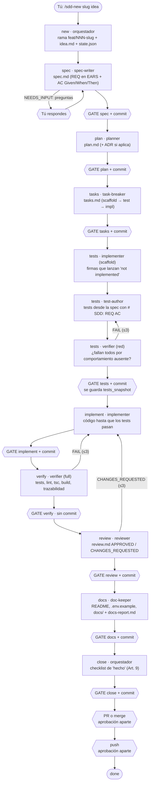

# Guía de uso del harness SDD de fitnerd

Esta guía explica cómo llevar un cambio de fitnerd desde la idea hasta el merge con el harness de Spec-Driven Development, pensada para quien no lo ha usado nunca. La visión general de la arquitectura está en [`README.md`](README.md), las reglas en [`specs/constitution.md`](../../specs/constitution.md) y las decisiones de diseño en [`decisions/`](decisions/README.md).

> **Ejemplos reales.** Todo lo que se muestra aquí salió de dos features que recorrieron el flujo completo durante la prueba en seco:
> - [`specs/000-example/`](../../specs/000-example/): frontend, una pausa de aprobación en cada etapa.
> - [`specs/001-health-endpoint/`](../../specs/001-health-endpoint/): backend, con modo sin pausas y un ciclo de corrección.
>
> Cuando tengas dudas sobre cómo debe quedar un artefacto, ábrelos.

---

## 1. Requisitos previos

### Qué tienes que tener instalado

| Herramienta | Para qué | Cómo comprobarlo |
|---|---|---|
| Claude Code | El orquestador y los subagentes | `claude --version` |
| Git (en Windows, con Git Bash) | Ramas y commits; los hooks se ejecutan con Git Bash | `git --version` |
| Node.js ≥ 20 | Hooks, `ruff-new.mjs` y frontend | `node --version` |
| Dependencias del frontend | Tests, lint y build | `cd frontend && npm ci` |
| `.venv` del backend con ruff | pytest y el control de ruff (ratchet) | `cd backend && .venv/Scripts/python.exe -m pip install -r requirements.txt -r requirements-dev.txt` |
| Docker | Postgres con pgvector para los tests del backend | `docker compose up -d postgres` (puerto 5433) |
| `backend/.env` con `TEST_DATABASE_URL` y las claves JWT | Configuración de los tests del backend | `backend/.env.example`, y `python scripts/generate_jwt_keys.py` para las claves |

### Cómo comprobar que el harness funciona

Ejecuta estas comprobaciones desde la raíz del repo. Todas deben salir bien:

```bash
node --test .claude/hooks/                      # 15 tests de los hooks → "pass 15, fail 0"
node .claude/sdd/scripts/ruff-new.mjs           # "sin violaciones nuevas. OK" (sale con 2 si falta ruff)
cd frontend && npm test && cd ..                # la suite del frontend en verde
cd backend && .venv/Scripts/python.exe -m pytest -q && cd ..   # la suite del backend en verde (necesita Postgres)
```

Dentro de Claude Code:
- **`/agents`:** tienen que aparecer los 8 agentes: `spec-writer`, `planner`, `task-breaker`, `test-author`, `implementer`, `verifier`, `reviewer` y `doc-keeper`.
- **`/sdd-status`:** tiene que responder con la tabla de features, aunque esté vacía.
- **Prueba del hook:** pide a Claude que cree un archivo en `backend/` mientras estás en `main`. Tiene que bloquearlo con un mensaje que empieza por `[SDD stage-guard]`.

> ⚠️ **Los comandos `/sdd-*` solo los puedes escribir tú.** Claude no puede lanzarlos por su cuenta, porque llevan `disable-model-invocation`. Si le pides "arranca una feature", te pedirá que escribas el comando. Es intencionado: el flujo siempre lo inicia una persona.

---

## 2. Mapa del flujo



- **Cajas normales:** las ejecuta un agente. Las de `new` y `close` las ejecuta el orquestador, que es la sesión principal de Claude Code.
- **Hexágonos (`GATE`):** el flujo se detiene y espera tu "aprobado" explícito.
- **Commit y push:** cada `git commit` se aprueba con un resumen (Regla B). Cada `git push`, merge o PR se aprueba aparte (Regla C).
- **Límite de correcciones:** los ciclos se cortan en **3 iteraciones**. Si se agotan, el orquestador se detiene y te consulta.

---

## 3. Recorrido paso a paso

Este es el recorrido real de la feature `000-example` (una función `clamp` en el frontend).

### Paso 0: crear la feature
```
/sdd-new example Función utilitaria clamp(value, min, max) en frontend/src/lib/ que devuelve el valor limitado al rango [min, max] y lanza un error si min > max.
```
- **Qué hace el orquestador:** comprueba que el árbol de trabajo esté limpio, que estés en `main` y que el slug no exista. Después te propone el tipo, el ámbito, la rama y la carpeta.
- **Qué haces tú:** respondes "sí".
- **Qué se crea:** la rama `feat/NNN-slug`, `specs/NNN-slug/idea.md` y `state.json`. Todavía no hay commit.

### Paso 1: arrancar el orquestador
```
/sdd-run 000-example
```
A partir de aquí, el orquestador ejecuta **una etapa**, te muestra un resumen, espera tu respuesta y sigue con la siguiente.

### Paso 2: spec
- **Qué produce el `spec-writer`:** `spec.md`, con requisitos `REQ-001…` en formato EARS y criterios `AC-001.1…` en Given/When/Then.
- **Si algo es ambiguo,** el agente devuelve `NEEDS_INPUT` y el orquestador te muestra una tabla de preguntas, cada una con una respuesta propuesta:
  ```
  | Q1 | ¿Cómo se trata NaN? | Si value es NaN, devuelve NaN; si min o max es NaN, lanza RangeError |
  ```
  Responde "todas por defecto" o pregunta por pregunta. Tus respuestas se copian tal cual en `spec.md` y el agente las incorpora.
- **Qué revisar:** ¿es lo que quieres? ¿Falta algún caso límite o de error? ¿Está claro lo que queda fuera de alcance? **Es tu mejor momento para cambiar las cosas**, porque aquí es barato.

### Paso 3: plan
- **Qué produce el `planner`:** `plan.md`, con el impacto por capa, los contratos, la estrategia de pruebas y los riesgos.
- **Qué revisar:** ¿encaja con la arquitectura? ¿Hay migración? ¿Reutiliza lo que ya existe? ¿Los riesgos son razonables?

### Paso 4: tasks
- **Qué produce el `task-breaker`:** `tasks.md`, con tareas `T-NNN [REQ, AC] (tipo)` en orden: primero `scaffold`, luego `test` y luego `impl`.
- **Qué revisar:** que cada criterio de aceptación tenga un test y que ninguna tarea se salga del plan.

### Paso 5: tests (TDD)
Aquí intervienen tres agentes seguidos:
1. **`implementer` (modo scaffold):** crea las firmas nuevas, que solo lanzan `not implemented`.
2. **`test-author`:** escribe los tests a partir de la spec. Cada uno va con el marcador `// SDD: REQ-001 AC-001.1`.
3. **`verifier` (modo red):** comprueba que **cada** test falla por comportamiento ausente, no por errores de sintaxis ni de import.

**Qué revisar:** lee 2 o 3 tests y comprueba que prueban el criterio que dicen probar. Al aprobar, el orquestador guarda los hashes de los tests en `tests_snapshot`.

### Paso 6: implement
- **Qué produce el `implementer`:** el código mínimo para que todo quede en verde. No puede tocar los tests: un hook lo bloquea.
- **Qué revisar:** que el cambio se limite a lo planeado.

### Paso 7: verify
- **Qué ejecuta el `verifier` (modo full):** tests, lint, `tsc`, build, el control de ruff y la trazabilidad (cada AC tiene su test y cada REQ su tarea).
- **Commit:** esta etapa no genera commit. Su informe se incluye en el commit de review.
- **Qué revisar:** que todo esté en verde, y si hay AC marcados como "manual", pruébalos tú en la app.

### Paso 8: review
- **Qué hace el `reviewer` (opus):** revisa el cambio contra la spec, el plan y la constitución, y comprueba que los tests no cambiaron.
- **Resultado:** puede ser `APPROVED` o `CHANGES_REQUESTED`, con hallazgos BLOQUEANTE, MAYOR, MENOR o NIT.
- **Qué decides tú:** qué hacer con los hallazgos MENOR y NIT: corregirlos (se abre un ciclo de corrección) o aceptarlos.

### Paso 9: docs
- **Qué hace el `doc-keeper`:** actualiza el README, los `.env.example` y `docs/` si hace falta. Si no, deja escrito en `docs-report.md` por qué no.

### Paso 10: close
El orquestador:
1. repasa la checklist de "hecho" de la constitución (Art. 9);
2. propone el commit `Close NNN-slug`;
3. te pregunta cómo integrar: **PR** (recomendado, porque dispara el CI) o merge local;
4. propone el push. Cada paso se aprueba aparte.

### Cómo aprobar o pedir cambios

| Tú respondes | Resultado |
|---|---|
| `1. Sí. 2. Sí` | Se aprueba la etapa y se hace el commit |
| `1. Sí. 2. No` | Se aprueba la etapa, pero sus cambios se suman al commit siguiente |
| `Cambia REQ-003 para que…` | El orquestador devuelve tu indicación al agente de esa etapa y vuelve a mostrarte el resumen |
| Silencio o "mmm" | **No cuenta como aprobación.** El flujo se queda esperando. |

### Cómo es un resumen de aprobación típico

```markdown
## Etapa `tests` cerrada · feature `000-example`
**Agentes:** implementer (scaffold) → test-author → verifier (red) · **Iteración:** 1/3
**Producido:** clamp.ts (esqueleto) · clamp.test.ts (20 tests) · verify-report.md
**Verificación:** 20/20 fallan por comportamiento ausente · 9 preexistentes siguen verdes
**Qué debes revisar tú:** lee 2-3 tests …
**Siguiente etapa:** implement (implementer)
---
## Commit propuesto (Regla B)
**Rama:** feat/000-example
frontend/src/lib/clamp.test.ts | 138 +
frontend/src/lib/clamp.ts      |   3 +
…
**Mensaje:** Add failing tests for 000-example (REQ-001..REQ-007)
---
Responde: 1. ¿Apruebas cerrar la etapa tests?  2. ¿Apruebas el commit?
```

Así es una propuesta de push (Regla C):
```markdown
## Push propuesto (Regla C)
**Origen → destino:** feat/000-example → origin/feat/000-example
**Commits a subir:** 18c19c6 Add spec… · 56cc4bb Add plan… · … (lista completa)
¿Apruebas el push?
```

Además del resumen, Claude Code te mostrará **su propia confirmación nativa** al ejecutar `git commit` o `git push`. Esa confirmación la pone el hook `git-guard` y es intencionada.

---

## 4. Orquestador o comandos sueltos

| Usa… | Cuándo |
|---|---|
| **`/sdd-run [NNN-slug]`** | Casi siempre. Encadena las etapas, con una pausa entre cada una, y retoma donde se quedó. |
| **`/sdd-<etapa> NNN-slug`** | Para repetir una etapa concreta (por ejemplo, rehacer el plan), para ir despacio aprendiendo, o si `/sdd-run` se interrumpió a mitad de una etapa. No pasa sola a la siguiente. |
| **`/sdd-status`** | Para ver en qué punto está cada feature. Es de solo lectura y no cambia nada. |

Repetir una etapa que ya aprobaste **la reabre**, y con ella todas las posteriores. El orquestador te pide confirmación antes.

**Modo sin pausas.** Puedes pedirle al orquestador que ejecute varias etapas seguidas sin detenerse, por ejemplo de `plan` a `verify` con un solo commit al final, como en la feature `001`.
- Queda registrado en `state.json.gate_mode`.
- El orquestador se detiene igualmente si un agente necesita respuestas, si algo falla 3 veces o si hay un problema de entorno.
- **El coste:** no revisas el plan ni las tareas antes de que se escriba código. Úsalo solo en features pequeñas y bien entendidas.

---

## 5. Referencia de comandos

| Comando | Para qué sirve | Entrada | Salida |
|---|---|---|---|
| `/sdd-new` | Crear una feature | `<slug> <idea>` | Rama `feat/NNN-slug`, `idea.md` y `state.json` |
| `/sdd-run` | Orquestar el flujo completo | `[NNN-slug]` (si falta, se deduce de la rama) | Las etapas, una a una, con sus pausas |
| `/sdd-status` | Ver el estado y detectar incoherencias | `[NNN-slug]` | Tabla, detalle y siguiente paso sugerido |
| `/sdd-spec` | Etapa spec | `[NNN-slug]` | `spec.md` |
| `/sdd-plan` | Etapa plan | `[NNN-slug]` | `plan.md` y ADRs |
| `/sdd-tasks` | Etapa tasks | `[NNN-slug]` | `tasks.md` |
| `/sdd-test` | Etapa tests (scaffold, tests y red check) | `[NNN-slug]` | Esqueletos, tests y `verify-report.md` (red) |
| `/sdd-implement` | Etapa implement | `[NNN-slug]` | Código de producción |
| `/sdd-verify` | Etapa verify | `[NNN-slug]` | `verify-report.md` (full) |
| `/sdd-review` | Etapa review | `[NNN-slug]` | `review.md` |
| `/sdd-docs` | Etapa docs | `[NNN-slug]` | Documentación y `docs-report.md` |
| `/sdd-close` | Cierre | `[NNN-slug]` | Checklist, commit de cierre, PR o merge y push |

---

## 6. Referencia de agentes

| Agente | Modelo | Qué hace | Puede escribir en | No puede |
|---|---|---|---|---|
| `spec-writer` | opus | Convierte la idea en requisitos y criterios de aceptación, y pregunta lo que no está claro | `specs/NNN/spec.md` | Proponer una implementación, tocar código, ejecutar comandos |
| `planner` | opus | Diseño técnico, riesgos y ADRs | `plan.md`, `docs/sdd/decisions/` | Tocar código o tests, cambiar el alcance |
| `task-breaker` | sonnet | Descompone el plan en tareas trazables | `tasks.md` | Tocar código, añadir alcance |
| `test-author` | sonnet | Tests a partir de la spec, antes de la implementación | `backend/tests/**`, `*.test.ts(x)` y las casillas de `tasks.md` | Tocar producción, desactivar tests, usar git con escritura |
| `implementer` | sonnet | Esqueletos (etapa tests) y código de producción (etapa implement) | `backend/**` y `frontend/**` salvo tests, `.env.example` y casillas | **Modificar tests**, spec o plan; usar git con escritura |
| `verifier` | haiku | Ejecuta las comprobaciones y reporta | `verify-report.md` y `state.json` (red_check/verify) | Arreglar nada |
| `reviewer` | opus | Revisión independiente | `review.md` | Editar código |
| `doc-keeper` | sonnet | Actualiza la documentación afectada | READMEs, `.env.example`, `docs/` (salvo `decisions/`) y `docs-report.md` | Tocar código, tests o artefactos SDD |

Todos leen `specs/constitution.md` y trabajan solo con archivos en disco. Ninguno puede lanzar otros subagentes, hacer commit ni hacer push; eso lo hace solo el orquestador, siempre con tu aprobación.

---

## 7. Casos especiales

### Bugfix
```
/sdd-new login-redirect-loop Al expirar el token, /login redirige en bucle a /home…
```
- **Tipo:** el orquestador propone `fix` y la rama `fix/NNN-slug`.
- **Spec:** describe el comportamiento **correcto** e incluye un AC que reproduce el bug.
- **Etapa tests:** el test de regresión es el que debe fallar en el red check. Así queda demostrado que reproduce el bug.

### Cambios pequeños sin spec (constitución, Art. 1.2)
Typos, cambios solo de copy o estilos sin lógica, y actualizaciones de dependencias sin cambios de API:
- **Sin flujo SDD**, pero **con commit aprobado** (Regla B).
- **Si tocan `backend/` o `frontend/`,** el `stage-guard` los bloqueará si no estás en una rama de feature. En ese caso usa el bypass (ver *Hotfix*).
- **Duda frecuente:** si dudas de si algo "es solo copy", probablemente no lo es. Pasa por spec.

### Refactor
- **Tipo:** `refactor`. La spec dice explícitamente que **no cambia el comportamiento observable**, y sus requisitos describen el comportamiento que hay que preservar.
- ⚠️ **Limitación actual:** los tests de caracterización pasan desde el principio, y el red check espera que fallen, así que dará FAIL. Por ahora, en la pausa de la etapa `tests` dile al orquestador que **aceptas el FAIL del red check porque es un refactor**; lo registrará en `history`. Es una de las mejoras previstas (ver el final de la guía).

### Hotfix urgente
1. Cierra Claude Code y ábrelo con el bypass:
   - PowerShell: `$env:SDD_BYPASS=1; claude`
   - Git Bash: `SDD_BYPASS=1 claude`
2. Crea `fix/NNN-slug`, arregla, ejecuta los tests y haz commit y push con aprobación (Reglas B y C).
3. **Cierra Claude Code y ábrelo sin la variable.**
4. Documenta el arreglo después con `/sdd-new` (spec retroactiva, Art. 1.2).

El bypass abre solo el `stage-guard`. Los roles de los agentes siguen protegidos.

### Cambiar una spec ya aprobada
- **Cómo:** ejecuta `/sdd-spec NNN-slug` y explica el cambio.
- **Qué pasa:** el orquestador te avisa de que reabre `spec` y **todas las etapas posteriores**, que tendrán que volver a aprobarse.
- **Por qué:** es deliberado. Un cambio en la spec invalida el plan, las tareas y los tests.

### Retomar una feature a medias
```
/sdd-status                 # ¿dónde me quedé?
/sdd-run NNN-slug           # retoma desde state.json
```
- **Si había un resumen pendiente de aprobar** (`awaiting_approval`), el orquestador **te lo vuelve a mostrar**. No lo da por aprobado.
- **Si la feature estaba bloqueada** (`blocked`), te explica qué la desbloquea.
- **Si cambiaste de rama,** vuelve a la de la feature: el orquestador te lo propone.

### Cosas que no son evidentes
- **El sha de cada commit se guarda en `state.json` con un commit de retraso.** El sha solo existe después de hacer el commit, así que ese registro entra en el commit siguiente. Es normal.
- **La etapa `verify` no genera commit.** Su informe se incluye en el commit de review.

---

## 8. Resolución de problemas

| Síntoma | Causa probable | Qué hacer |
|---|---|---|
| El orquestador se detiene con "3 iteraciones sin éxito" | El agente no consigue arreglarlo, o el problema está más arriba (spec o plan) | Lee el resumen de los intentos. Elige entre (a) dar más iteraciones, (b) ajustar la spec o el plan, (c) intervenir a mano o (d) abandonar. Si falla siempre el mismo test, revisa si el test o el AC están mal definidos. |
| `BLOCKED (entorno)` en verify o tests | Postgres apagado, falta `.venv` o `node_modules`, o ruff no está instalado (el control de ruff sale con 2) | `docker compose up -d postgres`, `npm ci`, `pip install -r requirements-dev.txt`. Después, `/sdd-run` para reintentar. |
| Un hook bloquea algo legítimo (`[SDD stage-guard]` o `[SDD role-guard]`) | Rama equivocada, etapa de `state.json` que no corresponde, o la ruta no pertenece al rol | Lee el mensaje, que dice qué falla. Comprueba la rama con `git branch --show-current` y el estado con `/sdd-status`. Si de verdad es legítimo: `SDD_BYPASS=1` (solo para `stage-guard`) o `{"disableAllHooks": true}` en `.claude/settings.local.json` **de forma temporal**. Ver [`hooks.md`](hooks.md). |
| Un agente se salió de su rol, por ejemplo tocando un test desde la shell | Los hooks solo vigilan `Write` y `Edit`, no la shell | El reviewer lo detecta porque los hashes no coinciden con `tests_snapshot`. Pide al orquestador que descarte el cambio (`git checkout -- <archivos>`) y que repita la etapa. Anótalo como incidente. |
| `state.json` incoherente, por ejemplo una etapa aprobada sin su artefacto o un JSON inválido | Edición a mano, o una sesión cortada a mitad | `/sdd-status` lo diagnostica y propone la corrección. Aplícala **con aprobación** y valida con `node -e "JSON.parse(require('fs').readFileSync('specs/NNN-slug/state.json','utf8'))"`. Si hay dudas, `git log -p -- specs/NNN-slug/state.json` muestra la historia. |
| No aparece `/sdd-run` o un agente | Archivos mal ubicados, o YAML inválido en el frontmatter | Comprueba `.claude/skills/sdd-run/SKILL.md` y `/agents`. Los cambios en agentes y skills se recargan sin reiniciar. |
| El verifier escribe un informe desordenado o con fechas raras | Haiku ignoró el formato | El protocolo ya refuerza el formato y las fechas del sistema. Si se repite, sube el `verifier` a `sonnet` (una línea en `.claude/agents/verifier.md`, ADR-0006). |

---

## 9. Buenas prácticas y errores comunes

### Cómo escribir una buena idea inicial
- **Di qué y para quién, no cómo:** "Quiero ver mi progreso de peso en las últimas 4 semanas" es mejor que "Crea un endpoint GET /metrics?weeks=4".
- **Incluye lo que ya sabes:** casos límite, mensajes, permisos, qué queda fuera. Cada cosa que digas es una pregunta menos del spec-writer.
- **Una feature por idea.** Si la idea tiene "y además…", probablemente son dos features.

### Qué revisar con más atención en cada pausa
- **spec:** es **la más importante**, porque todo lo demás se deriva de ella. ¿Los AC son comprobables? ¿Falta algún caso de error?
- **plan:** ¿migraciones? ¿seguridad (`@require_auth` y filtrado por `user_id`)? ¿se reutiliza lo existente?
- **tests:** lee algunos tests. Un test débil (por ejemplo, un secreto que no se inyecta) pasa todas las comprobaciones mecánicas. Justo eso lo detectó el reviewer en la feature `001`.
- **review:** decide qué hacer con cada hallazgo MENOR o NIT; no los ignores en bloque.

### Errores comunes
- ❌ **Aprobar la spec sin leerla** para "ir rápido": los errores de spec son los más caros.
- ❌ **Editar a mano un artefacto de otro rol**, por ejemplo corregir un test tú mismo durante `implement`. Rompe la trazabilidad y los hashes. Pide el cambio a través del orquestador.
- ❌ **Dejar `SDD_BYPASS=1` o `disableAllHooks` activos** después de usarlos.
- ❌ **Mezclar cambios ajenos a la feature** en la misma rama. El reviewer los marcará y la historia de git se vuelve confusa.
- ❌ **Usar el modo sin pausas en features grandes o delicadas**, como las de auth, pagos o migraciones.
- ✅ **Mantener cada spec pequeña:** de 3 a 8 requisitos. Si sale más grande, divídela.

---

## 10. Checklist rápido

```
ANTES DE EMPEZAR
[ ] git status limpio · en main · docker compose up -d postgres (si toca backend)
[ ] /sdd-new <slug> <idea: qué, para quién, casos límite, fuera de alcance>
[ ] /sdd-run NNN-slug

EN CADA PAUSA (respuesta explícita: "1. Sí. 2. Sí" / cambios)
[ ] spec     → ¿es lo que quiero? ¿AC comprobables? ¿errores y límites? ¿fuera de alcance?
[ ] plan     → ¿arquitectura/capas? ¿migración? ¿seguridad? ¿reutiliza?
[ ] tasks    → ¿cada AC tiene test? ¿nada fuera del plan?
[ ] tests    → leer 2-3 tests · red check PASS (fallan por comportamiento ausente)
[ ] implement→ diff acotado · tests intactos
[ ] verify   → todo verde · probar AC "manuales" en la app
[ ] review   → APPROVED · decidir MENOR/NIT (corregir o aceptar)
[ ] docs     → docs correctas o "sin cambios" justificado
[ ] close    → checklist Art. 9 ✅ · PR (recomendado) o merge · push (aprobación aparte)

SI ALGO SE TUERCE
[ ] /sdd-status                          → dónde estoy y qué falta
[ ] BLOCKED (entorno)                    → Postgres / npm ci / pip install -r requirements-dev.txt
[ ] hook bloquea                         → leer mensaje · rama · etapa · docs/sdd/hooks.md
[ ] 3 iteraciones fallidas               → decidir: más iteraciones / ajustar spec-plan / manual / abandonar
[ ] hotfix                               → SDD_BYPASS=1 al arrancar · fix/NNN · spec retroactiva · quitar bypass

NUNCA
[ ] aprobar por silencio · git add -A · --no-verify · push --force a main · editar artefactos de otro rol
```

---

## Mejoras previstas (segunda iteración del harness)

Las decisiones pendientes están en el resumen de la Fase 8. Las más relevantes para quien lo use:
- **Modo `refactor`:** red check invertido, con tests de caracterización que pasan antes y después.
- **Detectar escrituras hechas desde la shell** en los hooks, en vez de depender solo de los hashes.
- **CI:** añadir ruff, lint, `tsc` y build, y disparar los workflows también en ramas `feat/*` y `fix/*`.
