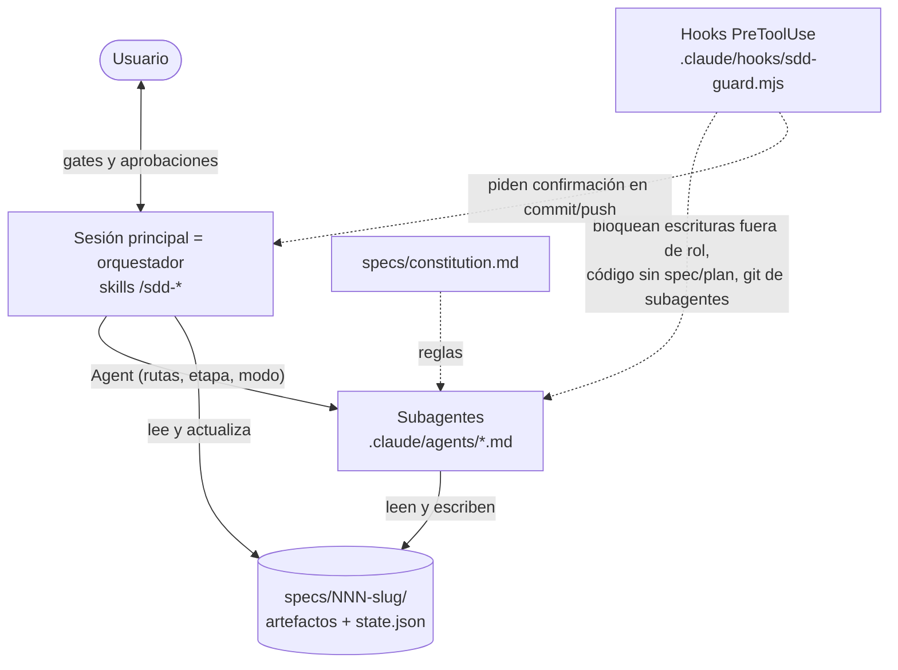

# Harness SDD de fitnerd

El desarrollo de fitnerd sigue **Spec-Driven Development**: cada cambio funcional se especifica, se diseña, se descompone en tareas, se prueba (TDD), se implementa, se verifica, se revisa y se documenta antes de integrarse.

- Cada etapa la ejecuta un **agente independiente con permisos separados**.
- El usuario aprueba el cierre de **cada etapa** y **cada commit y push**.

> La guía práctica paso a paso para usarlo es [`GUIA-DE-USO.md`](GUIA-DE-USO.md). Este documento es la visión general.

## Flujo

```mermaid
flowchart LR
    idea([Idea]) --> new["/sdd-new<br/>orquestador"]
    new --> spec["spec<br/>spec-writer"]
    spec --> G1{{gate}}
    G1 --> plan["plan<br/>planner"]
    plan --> G2{{gate}}
    G2 --> tasks["tasks<br/>task-breaker"]
    tasks --> G3{{gate}}
    G3 --> tests["tests<br/>test-author<br/>+ verifier (red)"]
    tests --> G4{{gate}}
    G4 --> impl["implement<br/>implementer"]
    impl --> G5{{gate}}
    G5 --> verify["verify<br/>verifier (full)"]
    verify --> G6{{gate}}
    G6 --> review["review<br/>reviewer"]
    review --> G7{{gate}}
    G7 --> docs["docs<br/>doc-keeper"]
    docs --> G8{{gate}}
    G8 --> close["close<br/>orquestador"]
    close --> G9{{gate + PR/merge<br/>+ push}}
    G9 --> done([done])

    tests -. "red FAIL (≤3)" .-> tests
    verify -. "FAIL (≤3)" .-> impl
    review -. "CHANGES_REQUESTED (≤3)" .-> impl
    review -. "hallazgo de spec/plan" .-> spec
```



- **gate:** el orquestador se detiene, muestra un resumen y el commit propuesto, y espera un "aprobado" explícito. Los pushes se aprueban aparte.
- **Líneas punteadas:** ciclos de corrección. Tras 3 iteraciones fallidas se escala al usuario.

## Piezas



- **Orquestador:** es la **sesión principal**, guiada por la skill `/sdd-run` (o una skill por etapa). No es un subagente, porque solo la sesión principal puede detenerse a pedir aprobación. Ver la [ADR-0001](decisions/ADR-0001-orquestacion.md).
- **Subagentes:** hay uno por rol. No pueden lanzar otros subagentes y se comunican **solo a través de archivos en disco**.
- **`state.json`:** es la máquina de estados de cada feature, con la etapa, las aprobaciones, los commits y las iteraciones.
- **Hooks:** son la barrera determinista contra las violaciones de rol. Ver [`hooks.md`](hooks.md).

## Agentes

| Agente | Modelo | Produce | No puede |
|---|---|---|---|
| `spec-writer` | opus | `spec.md` (REQ en EARS y AC en Given/When/Then) | proponer implementación ni tocar código |
| `planner` | opus | `plan.md` y ADRs | tocar código ni tests |
| `task-breaker` | sonnet | `tasks.md` (T-NNN con REQ y AC) | tocar código |
| `test-author` | sonnet | tests que fallan, escritos a partir de la spec | tocar producción |
| `implementer` | sonnet | código de producción | modificar tests, spec ni plan |
| `verifier` | haiku | `verify-report.md` (modo red o full) | arreglar nada |
| `reviewer` | opus | `review.md` (APPROVED o CHANGES_REQUESTED) | editar código |
| `doc-keeper` | sonnet | README, `.env.example`, `docs/` y `docs-report.md` | tocar código, tests ni artefactos SDD |

## Estructura de carpetas

```
CLAUDE.md                       reglas para Claude: flujo, comandos y aprobación antes de commit/push
.claude/
  settings.json                 hooks + CLAUDE_CODE_MAX_SUBAGENT_SPAWN_DEPTH=1
  agents/                       8 subagentes (uno por rol)
  skills/sdd-*/SKILL.md         12 comandos: run, new, status y uno por etapa
  sdd/protocol.md               reglas del orquestador (gates, commits, correcciones, state.json)
  sdd/stages.md                 tabla de etapas: agente, precondición, salida, commit y qué revisar
  sdd/scripts/ruff-new.mjs      ratchet de ruff (solo violaciones nuevas)
  hooks/sdd-guard.mjs           role-guard, stage-guard y git-guard (+ tests)
specs/
  constitution.md               principios no negociables
  _templates/                   spec, plan, tasks, state.json, review y verify-report
  NNN-slug/                     una carpeta por feature
docs/sdd/
  README.md                     este documento
  GUIA-DE-USO.md                guía práctica de principio a fin
  00-discovery.md               análisis del repo antes del harness
  hooks.md                      qué bloquea cada hook y cómo desactivarlos
  decisions/                    ADRs del harness y de las features
```

## Trazabilidad

La cadena es `REQ-001` (spec) → `AC-001.1` (spec) → `T-003 [REQ-001, AC-001.1]` (tasks) → `# SDD: REQ-001 AC-001.1` (test).

El `verifier` comprueba de forma mecánica que cada AC tiene un test que pasa y que cada REQ tiene al menos una tarea. Ver [`specs/README.md`](../../specs/README.md).

## Decisiones

Todas las decisiones de diseño del harness están en [`decisions/`](decisions/README.md), de la ADR-0001 a la ADR-0011.
